## Instructions to Run on FPGA

### 1. Open Quartus Prime 18.1
Open the provided project based on your dev board by going to file > Open Project 

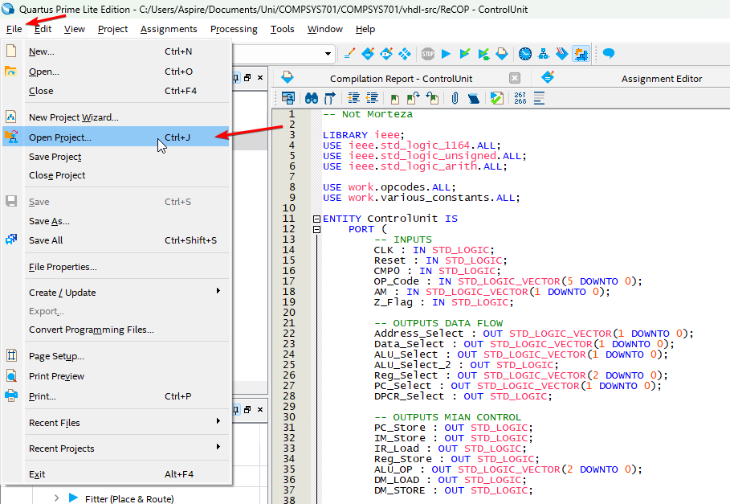

In the file explorer that opens up open the folder for your specific dev board and then select the `.qpf` file in there. 

Click `Open`

 This will open the quartus project and you will be able to compile. 

## Compile Design
Compile the design by clicking the Blue Triangle at the top or press `Ctrl + L` on your keyboard

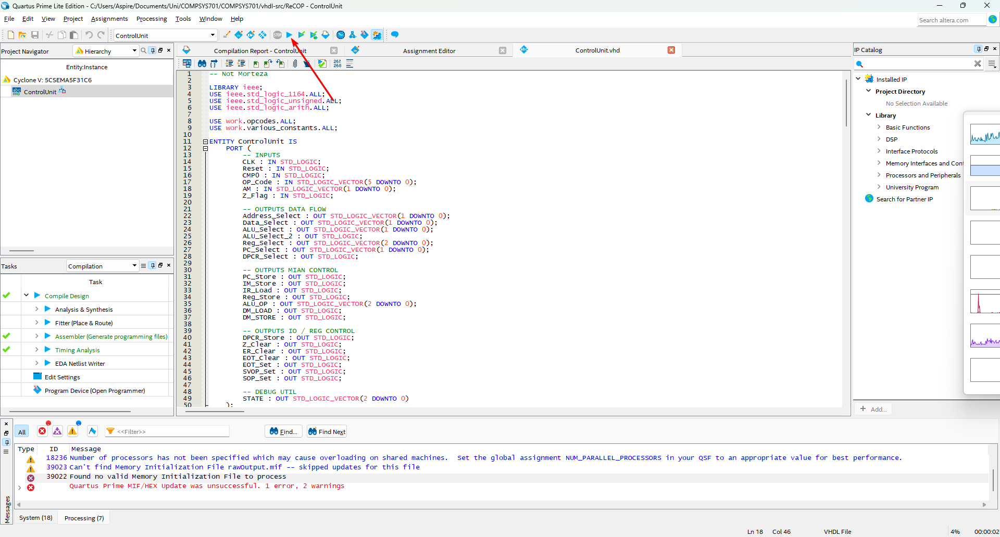

This process should take a little bit of time

If there are pin assignment errors you may need to import pin assignments. If not skip to programming the FPGA.

## Import the pin assignments

To import the pin assignments go to Assignments > Import Assignments

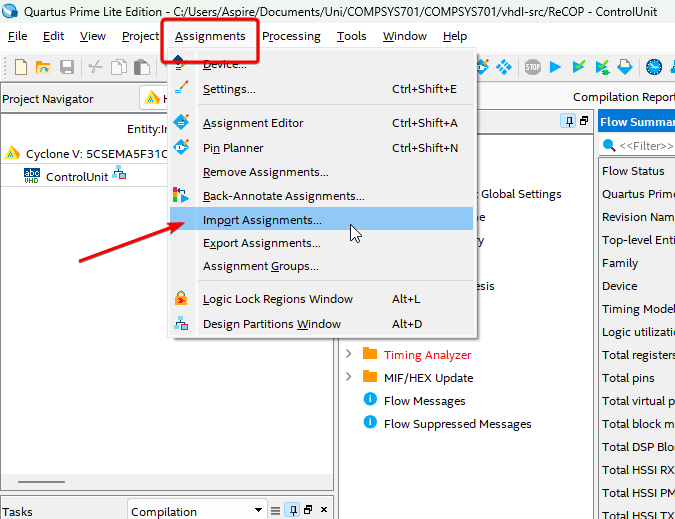

Select the 3 dots and find the proper pin assignment file for your board. It will either be `DE1_Soc.qsf` for a DE1 board and `RECOP-DE2.qsf` 

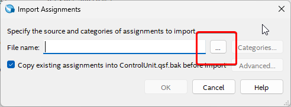

click `ok`

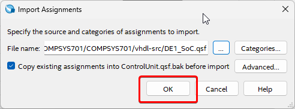

## Programming FPGA

Open the programmer (Blue square icon with a rainbow coming out)

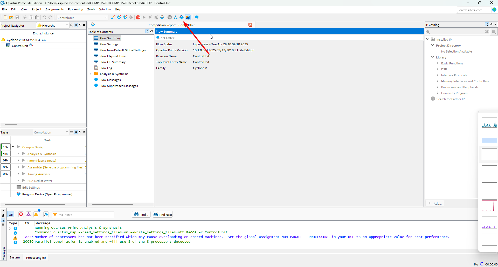

Select `Hardware Setup`
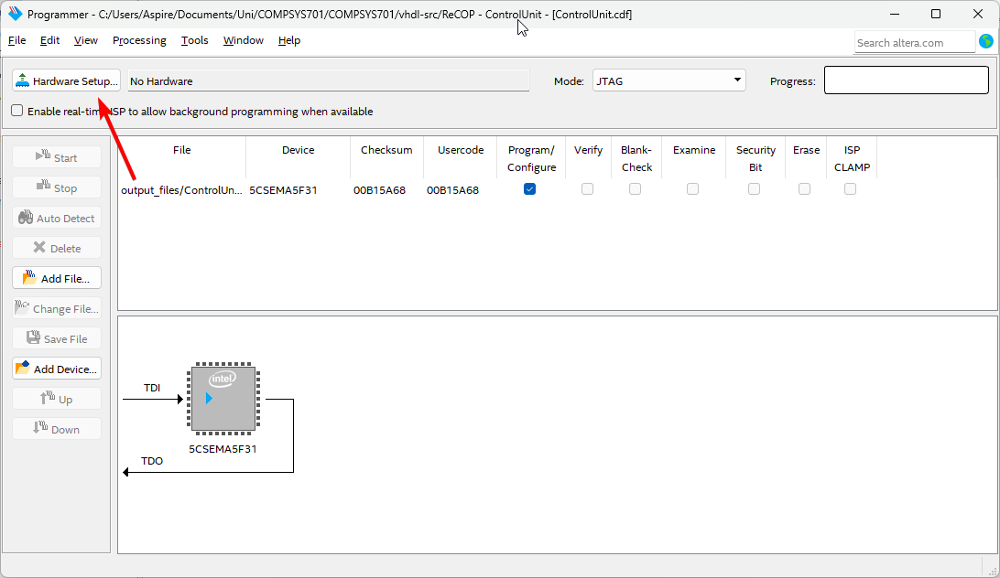

Make sure that the correct FPGA is selected 

Press `Close`

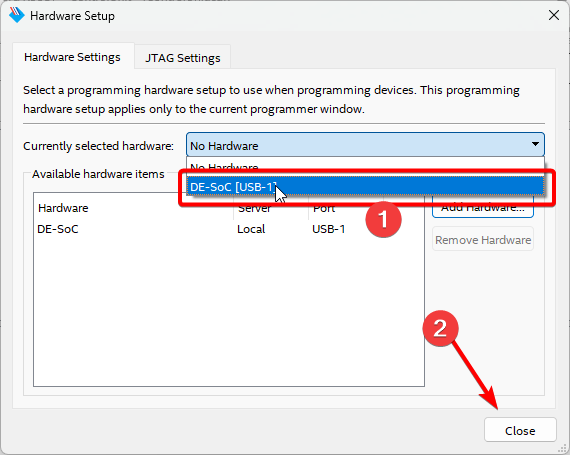

Select all existing configurations and delete them 

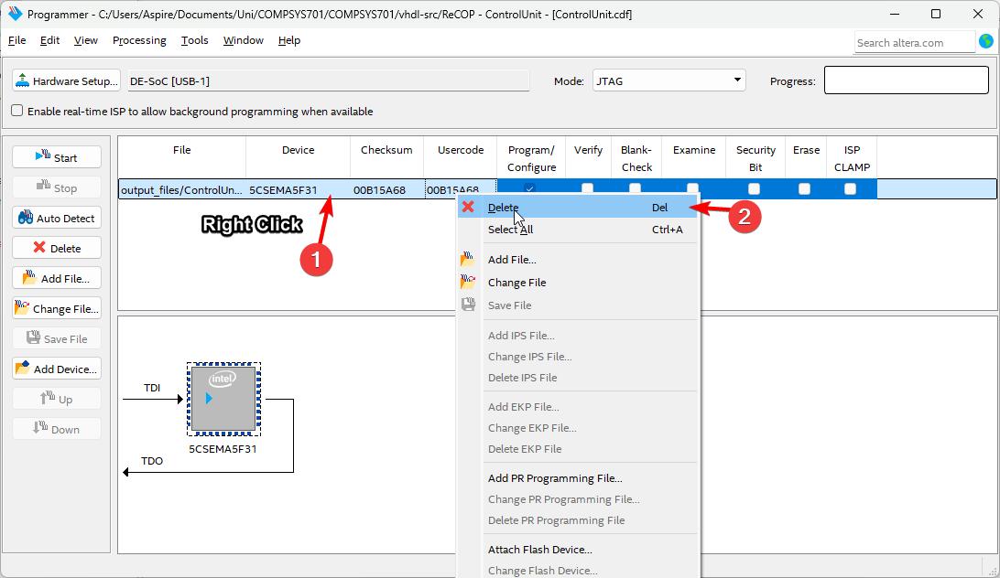

Click auto detect and select the *5CSEMA5* as the device in the popup.

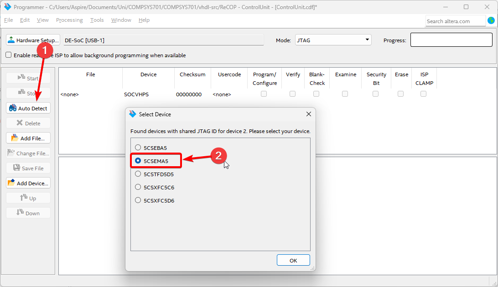

Select the "file" field of the second option in this menue and use the file explorer to navigate to and select the `.sof` file. In our case it should be in the `output` folder. 

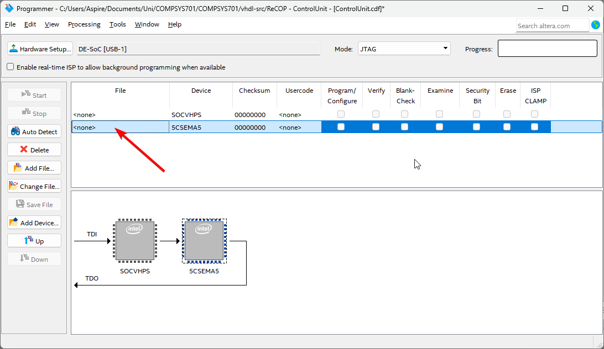

Now simply check the `program/configure` box and click the `start`
If the board was programmed succesfully then you will see a green box with "100% (Succesful)" in it as depicted in the media/image below.

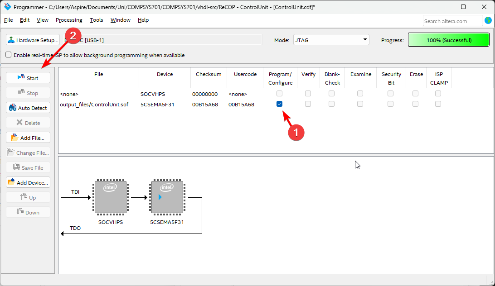
The Progress bar should then progress to 100%

If successful, the Board should show signs of life

The program.mif that was written to the FPGA was initially written in assembly instructions which was then converted into a .mif file.

1) The assembly instructions in file `program.asm`  can be viewed under `COMPSYS701\assembler\ReCOP-ASM Package\program.asm`

2) The .mif file can be viewed under `COMPSYS701\vhdl-src\program.mif`

To write a program, modify program.asm and use the instructions given in the instruction set. It should be written as normal assembly code, however the specific instructions can be found in the `instruction.md` table at the bottom of this file.

use mrasm.exe

use the command `./mrasm.exe program.asm` this command will output the appropriate .mif and a program.mif which will appear in `vhdl-src`

### Updating MIF file without having to recompile on Quartus Prime 18.1

Since the instructions above allows you to write your own assembly code based off the provided instructions below, the .mif file that is generated can also be updated for the Quartus project without needing to be recompiled. The instructions for this are here:

To update the .mif file

Go to:

Processing -> Update Memory Initialization File

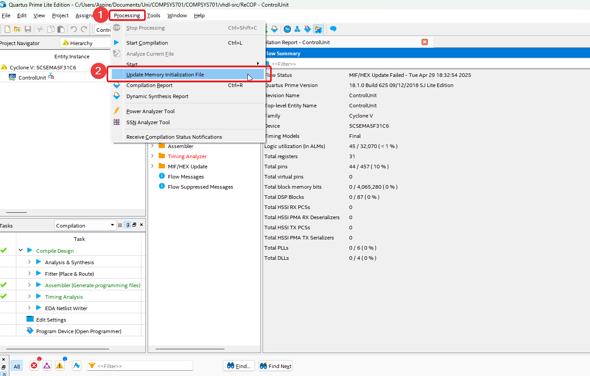

If this fails, then go into

Project > Add/Remove Files in Project

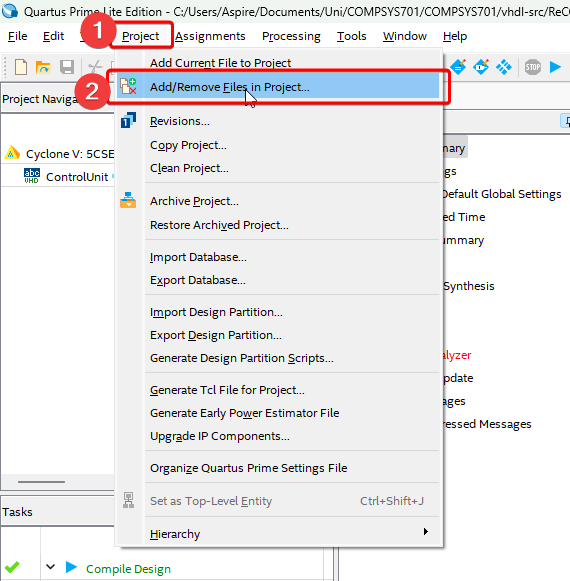

Select `program.mif` and click the remove button on the right

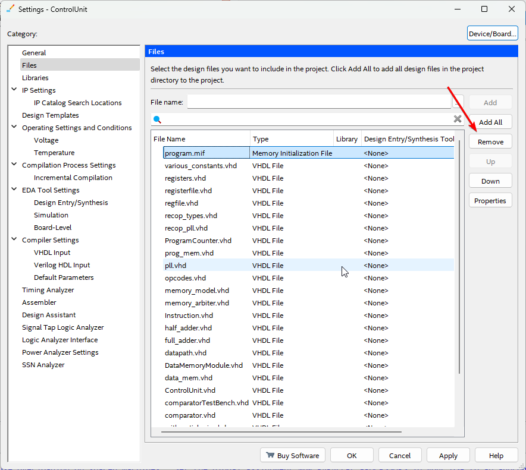

Use the three dots to open a file explorer to add the `.mif` file again.

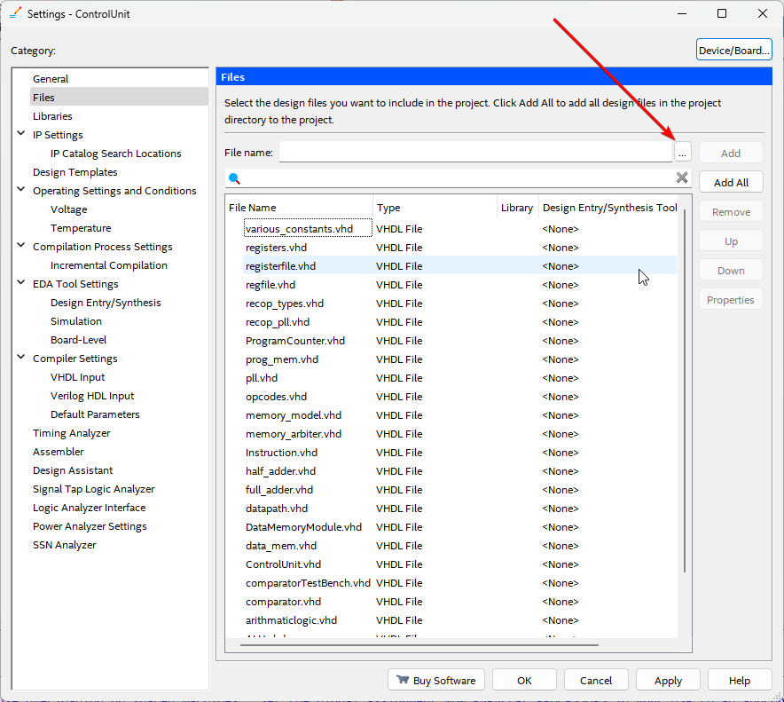

select program.mif (This one should be the new program.mif)

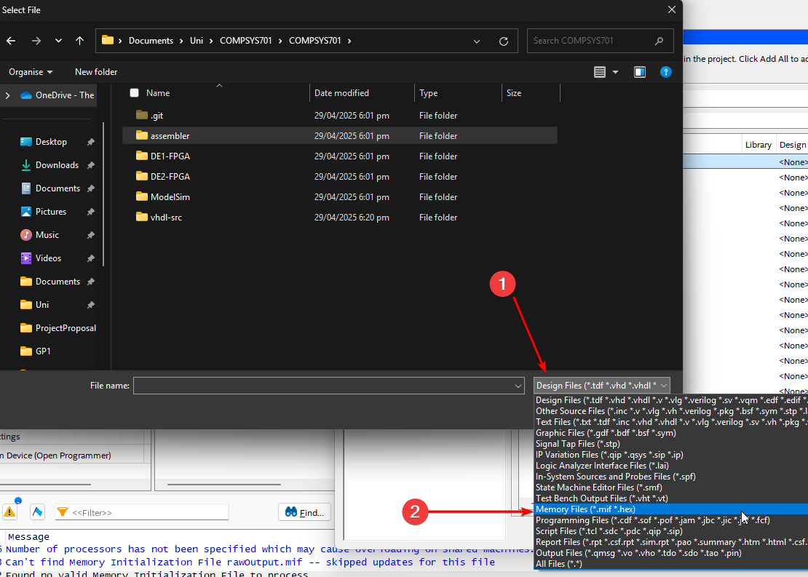

Change file type in the explorer to `Memory Files` if it is not already in that mode.

Navigate to the correct folder depnding on the FPGA in use and add the `.mif` in. Hit apply  

Attempt to update the .mif again

Processing -> Update Memory Initialization File

Once that has been done, re-program the FPGA using the same method as  earlier