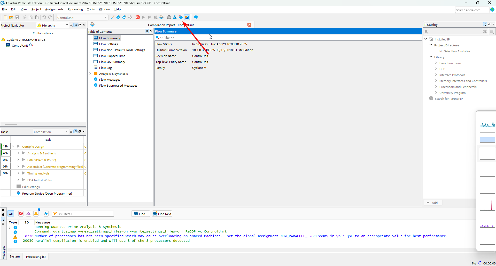

## Instructions to Run on FPGA

### 1. Open Quartus Prime 18.1 and select New Project Wizard

Click `next`

Choose the working idrectory as:

COMPSYS701/Quartus/

Name the project and top level entity with the name `701_Quartus`

Click on next

Select Empty Project and click on next

Click on the highlighted 3 dots:

Navigate to:
COMPSYS701/vhdl-src

and select all the .vhd files

Click `Open`

Click on the highlighted 3 dots again

Naviage to COMPSYS701

select program.mif

Click `Open`

Click `Next`

Select the Device Family appropriately (Either Cyclone IV or Cyclone V)

Find the appropriate board (look online)

Click on `next` until the `next` button can no longer be pushed

Click on Finish

Setting the top level entity:

Go to the project navigator and switch from Hierarchy to Files

In Files, right-click datapath.vhd and select `set as Top-Level entity`

## Import the pin assignments

To import the pin assignments go to Assignments > Import Assignments

select the 3 dots and find the proper pin assignment file for your board

click `ok`

Compile the design by clicking the Blue Triangle at the top or press `Ctrl + L` on your keyboard

This process should take a little bit of time

Once the compilation is successful

Open the programmer (Blue square icon with a rainbow coming out)

Select `Hardware Setup`

Make sure that the USB Blaster is selected

Press `Close`

Check the `File` to make sure that the .sof is selected (This should be automatically done by Quartus)

Press `Start`

The Progress bar should then progress to 100%

If successful, the Board should show signs of life

This done using the assembly instructions which is converted to a .MIF file, which is loaded onto the FPGA and accessed by our program memory. 

1) The assembly instructions can be viewed under: *your_repository_name/submission_files/quartus/input.asm*

2) The .MIF file can be viewed under: *your_repository_name/submission_files/quartus/output.mif*

To write a program, modify input.asm and use the instructions given in the instruction set. It should be written like normal assembly code however, there are some rules that need to be followed for ReCOP. 
- For JMP and PRESENT instructions, use labels as the operand (i.e address of jump)
- NOOP after PRESENT and JMP instructions and NOOP at the location of the label as the first instruction
- End each instruction using a semi-colon
- The instruction formatting is based on what is written in the given instruction set
- There is a typo in the assembler where 'SUBV' should be written as 'SUBVR' in the .asm file. 
- There are no comments allowed 
- Please refer to our report to find the instruction set that has been implemented to ensure that your code works
- If any issues, please contact the team. We have tested extensively each instruction that we have implemented and mentioned under the **Success** column of the instructions in our report before submission. So any errors can be fixed without having to change the implementation :)

Converting .ASM to .MIF using 16_to_32_conversion.py File:
1) Once the assembly code is ready, open 16_to_32_conversion.py. 
2) Within this python script, in the main, when it initally opens a python file (line 213), change the directory to where your assembly file is stored. This must be the absolute path. Only forward slashes (/) are alllowed. 
3) Then, run the python code and a .mif file is generated. 
4) Copy this .mif file and overwrite the .mif located in output.mif so that it is initialised in the program memory. 

### Updating MIF file without having to recompile on Quartus Prime 18.1

**From the instruction above, you can write your own assembly code based off the given instruction set. Use our assembler to generate the .MIF file, and load the updated MIF file (which consists of the updated instructions) without having to recompile the whole FPGA. The instructions to do so are as follows:**

Go to:

Processing -> Update Memory Initialization File as show below in the image

Upon success (show in image below), double click on Assembler and Program Device to load the new MIF file on the FPGA

Once that has been done, re-program the FPGA

