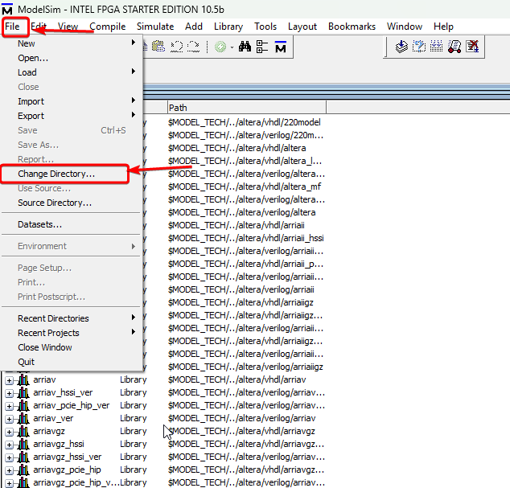
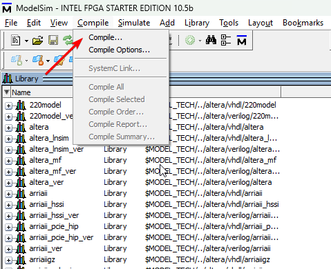
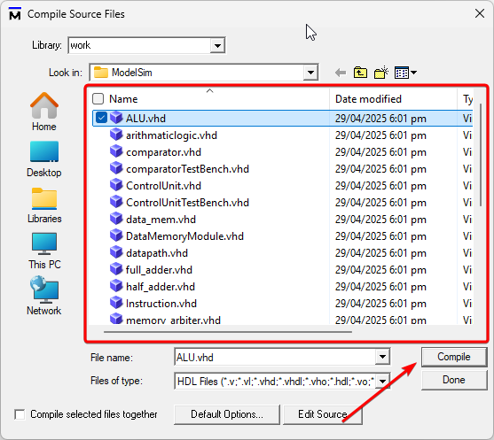
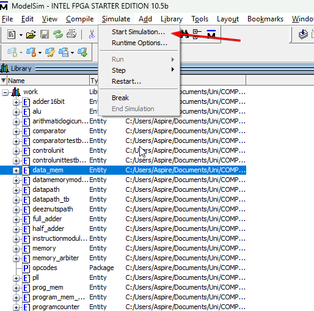
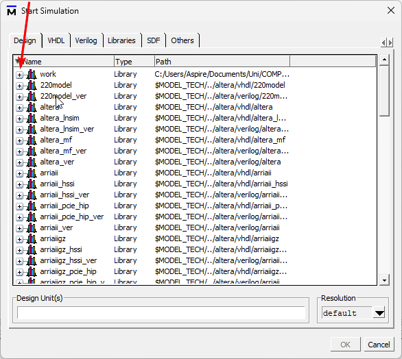
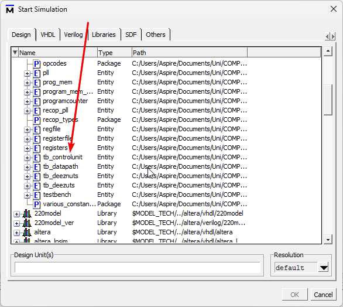
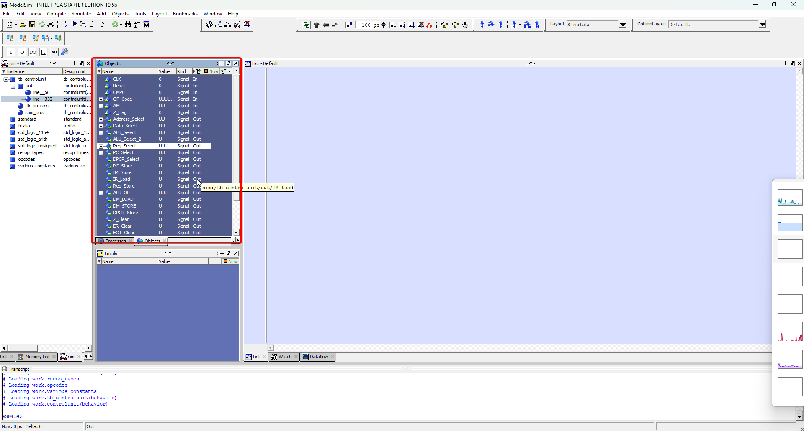
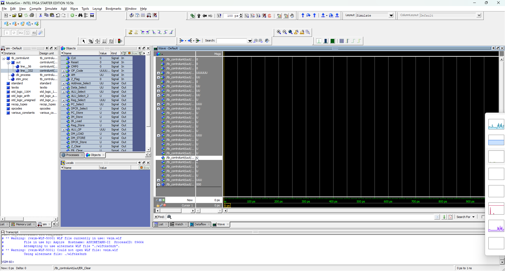
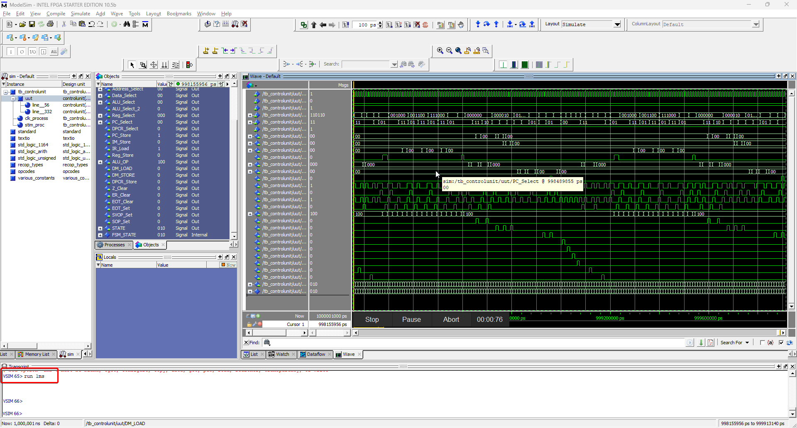

## Instructions to Run on FPGA

### 1. Open ModelSim

Click on File> Change Directory

Then select the `ModelSim` folder.

Press OK

### 2. Compiling the code

Navigate to Compile > Compile

**Compile the files in the following order, otherwise you will get errors**

1. half_adder.vhd
1. full_adder.vhd
1. 16-bit_adder.vhd
1. various_constants.vhd
1. registers.vhd
1. registerfile.vhd
1. regfile.vhd
1. recop_types.vhd
1. recop_pll.vhd
1. ALU.vhd
1. prog_mem.vhd
1. pll.vhd
1. memory_model.vhd
1. memory_arbiter.vhd
1. data_mem.vhd
1. comparator.vhd
1. ProgramCounter.vhd
1. ControlUnit.vhd
1. arithmaticlogic.vhd
1. Instruction.vhd
1. DataMemoryModule.vhd
1. datapath.vhd
1. ControlUnitTestBench.vhd
1. comparatorTestBench.vhd
1. AdderTestBench.vhd
1. tb_instructionMem.vhd
1. tb_DataPath.vhd
1. tb_ControlUnit.vhd

This process should create the `work` folder if it is not already present

If the compilation is successful, there should be no red lines in the output, if this happens, click `compile` again.

Once the compilation is successful, click `Done`

### 3. To simulate using ModelSim

Go to Simulation> Start Simulation

In the dialog box expand the `work` folder

Select the file `fileName`

Press `OK`

#### Viewing the waves inside ModelSim

use the following command inside the ModelSim terminal to display the waves in a new window.

add wave -position insertpoint sim:/tb_datapath/*

#### Running the simulation

Then use this `+` button to expand the work directory

Then you may need to scroll down to select the `tb_controlunit` to see the control unit standalone or `tb_datapath` to test the datapath

select a signal in the objects window and then use the shortcut `ctrl + A` to select all signals, then press `ctrl + w` to include the signals in our simulation. Alternatively only select the signals you want and then add the with `ctrl + w`.

To run the simulation, use the command

`run Xms` 
where X is the period of simulation (we recommend 1ms)

Once the simulation has finished, the central portion of the simulation window should be filled with various lines, the output of the program.

The radix of each individual signal can be changed in order to fit the user's prefered method of reading binary data (ModelSim supports Dec, Hex and Binary among others). This can be used to verify that the project is working properly.

If the assembly code was to be changed, follow the instructions in the last section of the README_FPGA.md file